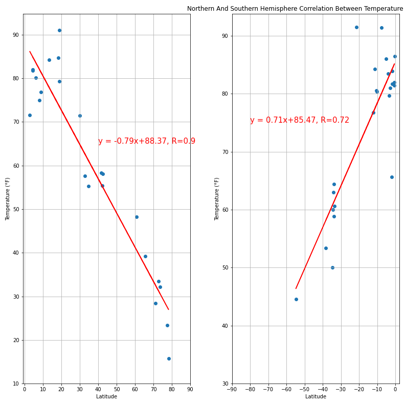
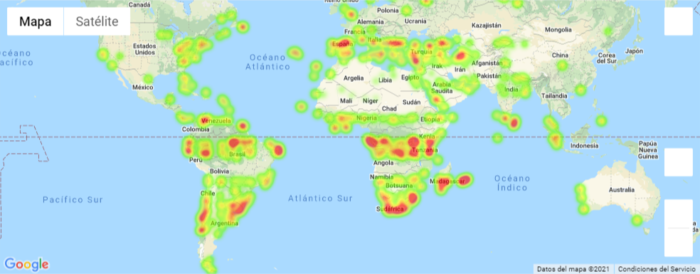
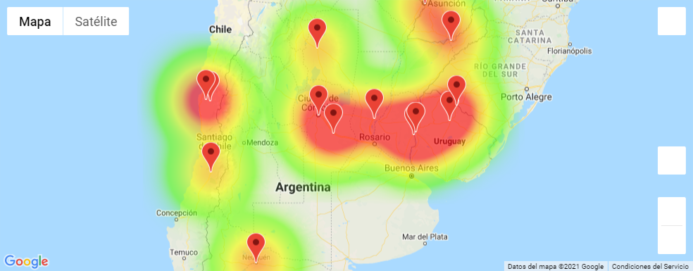

## **Overview**

- This application is splitted in 2 jupyter notebooks
    - [WeatherPy.ipynb](WeaherPy/WeatherPy.ipynb)
        - Searches for 500+ citites based on a randomly generated latitude longitude pairs
        - Performs data analysis on weather conditions to determine correlations between geographical position and some weather variables
    - [VacationPy.ipynb](VacationPy/VacationPy.ipynb)
        - Uses the csv file generated from WeatherPy to perform some analytics on Google API's
- Libraries used:
    - CitiPy by [wingchen](https://pypi.org/project/citipy/#files)
    - Numpy, json, requests, pandas, time, matplotlib, scipy, os, IPython, datetime
- The program runs requests to [OpenWeather](https://openweathermap.org/) API
    - In order to run the program you will need to get an API-key yourself and paste it into the [config.py](WeatherPy/config.py) file
    - However, if you don't want to use your API key, skip to cell 5 of the jupyter notebook and follow the instructions, you will lose the random samples though
- The program runs requests to [Google Places](https://cloud.google.com/) API for which you will need another API-key, use it at your own discretion since Google Cloud is a paid service

## **Repository structure**
``` bash
│   .gitignore                              #gitignore file
│   LICENSE                                 #license file
│   README.md                               #readme file
│
├───VacationPy                              #folder for vacationpy app
│   │   changelog.md                        #changelog vacationpy
│   │   config.py                           #config file, Google API key goes here
│   │   VacationPy.ipynb                    #main jupyter notebook
│
└───WeatherPy                               #folder for weatherpy
    │   changelog.md                        #changelog weatherpy
    │   config.py                           #config file, openWeather API key 
    │   WeatherPy.ipynb                     #main jupyter notebook
    │
    ├───plot_images                         #contains png files with all the plots
    │       cloud_lat.png
    │       hemi_cloud_lat.png
    │       hemi_humi_lat.png
    │       hemi_temp_lat.png
    │       hemi_wind_lat.png
    │       hum_lat.png
    │       temp_lat.png
    │       wind_lat.png
    │
    ├───resources                           #images for md formatting
    │       header.jpg
    │
    ├───results_csv                         #saved csv results from weatherpy
    │       weather_data_1619218389.csv
    │       weather_data_1619456878.csv
    │       weather_data_1619635358.csv
    │       weather_data_test.csv

```

## **Application Breakdown**

### *PyWeather*
- Using CitiPy I build a city list to be able to do the requests to OpenWeather API
    - In order to create the list I use a nested for that scans longitude and latitude to find the nearest cities
    - The latitude and longitude searches are generated randomly
        - Generating 50 lat/lon numbers (2500 searches) returns  ~370 cities
        - Generating 100 lat/lon numbers (10000 searches) returns ~870 cities
        - Generating 70 lat/lon numbers (4900 searches) returns 500+ cities in several tests, will keep these parameters
- The cities list generated is used to make a series of calls to Openweather API in order to retrieve data relevant for the analysis
- It is possible now to begin plotting data to find relations between variables
    - The plot parameters take into account the variability of the data
- All the graphs are saved as a png image in the [plot_images](WeatherPy/plot_images) folder



- The data used for the analysis is saved in the results_csv folder as "weather_data_timestamp.csv"
- If you wish to run the code witout making API calls skip to cell 5 of the jupyter notebook and follow the instrutions
- The csv file obtained by running [WeatherPy](WeatherPy/WeatherPy.ipynb) will be used on a second program useful to determine the best city to go on vacation
### *PyVacation*
- The vacation app is on [VacationPy.ipynb](VacationPy/VacationPy.ipynb)
- The application allows the user to choose any csv file obtained in [PyWeather](WeatherPy/WeatherPy.ipynb)
- If you wish to test the application witout the +500 cities the [weather_data_test](WeatherPy/results_csv/weather_data_test.csv) file contains only 40 cities
- However, if you still want to use the +500 cities list, the hotel search is done by sampling the list to 10 cities to avoid excessive Google Places API calls
- The application creates an humidity heat map



- The application filters the weather information to meet ideal weather conditions
- Form the filtered data, it plots a new humidity heatmap, and looks for hotels within 5,000 meters to the geographical center of the city, if Google API doesn't returns any hotels the city is droppped from the heatmap
- Finally the application adds a marker with the name of the hotel, the city and the country


